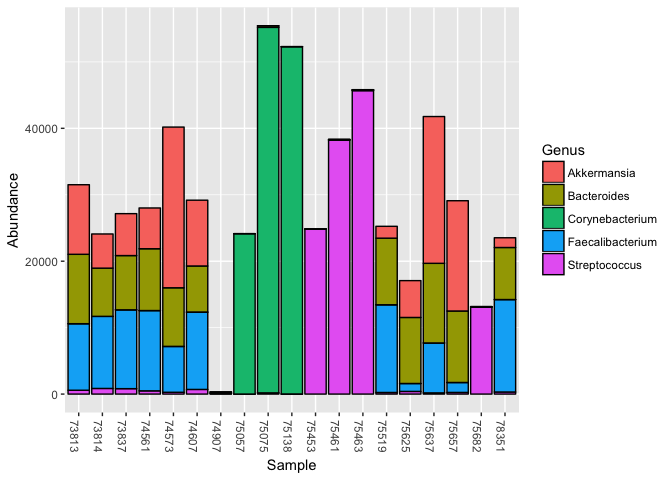
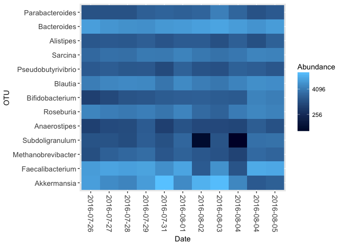
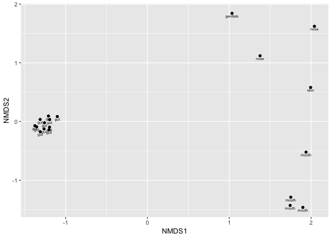

README
================
Richard Sprague
June 06, 2018

This package helps you read and manipulate uBiome and other consumer-formatted microbiome files in the open source package Phyloseq.

Introduction
------------

Phyloseq is an open source microbiome manipulation package in the BioConductor toolkit for R[1]. Introduced in 2013[2], it turns your microbiome data into an object-oriented representation that can be easily imported or exported to other common formats, and it supports many analysis techniques including calibration, filtering, subsetting, agglomeration, multi-table comparisons, diversity analysis, parallelized Fast UniFrac, ordination methods, and production of publication-quality graphics.

The combination of R, with RStudio, and Phyloseq is a powerful environment for microbiome investigation. Providing easy, interactive access to nearly every state-of-the-art algorithm in statistics, machine and deep learning, it can let uBiome researchers study our data quickly and iteratively, with exceptional plotting features that set the standard for publication-quality work.

Although the R language, compared to Python, can be more daunting for non-programmers, the package presented here should greatly simplify the process for scientists who already know the types of microbiome-related questions they want answered. If you are already familiar with the basic terms for how uBiome stores data in CSV files, you should be able to easily perform some powerful analysis and graphing by simply copying the environment and examples in this demo.

Prerequisites
-------------

If you are already a Python programmer, and you already have the [Anaconda environment](https://www.anaconda.com/download/), you can simply install [Anaconda RStudio](https://anaconda.org/r/rstudio). If you think you'll be doing regular serious programming for Python, you may want to study up on Anaconda anyway.

Otherwise, if you just want to get started as fast as possible on some of the examples in this book and don't want to deal just now with a bunch of other programming installs, just do this:

-   Download a (free) copy of open source licensed version of [RStudio](https://www.rstudio.com/products/rstudio/download/). Version are available for Mac, Windows, and Linux and they are all interchangable.

-   Install the latest (free) copy of [R](https://cran.rstudio.com/). You may as well install the latest possible version, at least version 3.4 or later.

### Setting up the machine

I want all my R apps to use the same data directory for everything, but when I give out my R code, I don’t want to expose my hard drive structure.

Create the file `.Rprofile` in your home directory. You can add any initialization code you like, but I added the following, to set a global environment variable every time I launch:

``` r
Sys.setenv(UBIOME_DATADIR = "/path/to/my/ubiome/data")
```

NOTE: the file must have a blank carriage return as the last line.

Setting this one system variable makes it easy to find my microbiome data on any machine. In my folder `/data`, I keep separate folders for each person whose data I have. Inside each person's folder, I have a series of JSON files that contain the microbiome data for that person. I also have one mapfile (explained below) in Excel with a label and other metadata for each JSON file. Optionally I'll also include a directory `/fastq` where I keep fastq files (if any) for that user.

To read a single JSON file for myself, I use the following R commands:

``` r
library(jsonlite)
UBIOME_DATADIR <- Sys.getenv("UBIOME_DATADIR")
myJSON <- jsonlite::read_json(file.path(UBIOME_DATADIR,"/richard_sprague/richard_sprague-2017-01-01-gut-123456.json"))
```

I name all my microbiome JSON files using the convention "name-date-site-ssr.json" to make it easier to find the correct JSON file later. Even if you have only a few of these files, I strongly recommend adopting a consistent naming scheme.

Loading the package
-------------------

If this is your first time to use Phyloseq, you will need to load a few prerequisites:

    > install.packages(c(""ggplot2","dplyr", "tidyr", "readxl"))
    > source("<https://bioconductor.org/biocLite.R>")
    > biocLite("phyloseq")

Once these are installed, download the `actino` package from this repo using the `devtools` package:

    > library(devtools)
    > install_github("richardsprague/actino")

You may find that you lack a number of prerequisites, such as the Phyloseq package and a few common packages like `dplyr` and `readxl`. The system will warn you, and then you should install them yourself in the manner in which you are accustomed.

Actino includes a few built-in phyloseq objects, including `kombucha.genus`. The following commands will plot the abundances:

``` r
library("actino")
library(phyloseq)
plot_bar(prune_taxa(taxa_sums(kombucha.genus)>100000,kombucha.genus), fill = "Genus")
```



To load a new phyloseq object from a JSON file you will need a mapfile, which is an Excel file containing a row for each sample, and several columns including "SSR", "Date", "Label" and more.

| Username       | Date       | SSR   | Site | Notes                    | Label       |
|:---------------|:-----------|:------|:-----|:-------------------------|:------------|
| RichardSprague | 2015-04-21 | 15372 | gut  | Before one week test     | Before Test |
| RichardSprague | 2015-04-28 | 15759 | gut  | After one week test      | After Test  |
| RichardSprague | 2015-05-26 | 60454 | gut  | After 3 days backpacking | backpacking |
| RichardSprague | 2015-10-19 | 27127 | gut  | morning of colon cleanse | CC          |

Load a standard uBiome-downloaded CSV file using this command:

``` r
experiment_to_phyloseq("myCSVfile.csv",mapfile)
```

and similarly, for a JSON file:

``` r
phyloseq_from_JSON_at_rank("myJSONfile.json",mapfile,rank="genus")
```

Either of these functions will generate a valid phyloseq object.

The package includes some sample data, which you can load like this:

``` r
data("kombucha.csv")
head(kombucha.csv)
```

    ##             tax_name     tax_rank count count_norm taxon parent ssr
    ## 1               root         root 77768    1035401     1      0   0
    ## 2           Bacteria superkingdom 75109    1000000     2 131567   0
    ## 3      Campylobacter        genus     2         26   194  72294   0
    ## 4     Flavobacterium        genus    60        798   237  49546   0
    ## 5     Alcaligenaceae       family    38        505   506  80840   0
    ## 6 Enterobacteriaceae       family    87       1158   543  91347   0

The data, loaded into the variable `kombucha.csv` is a dataframe created from a CSV file downloaded from the uBiome "Advanced" tab (see the section on [how to download your results as a CSV file](#rawDataDownloadCSV)). In this case, it's from one experiment of a user (me!) who drank several liters of kombucha each day to see the effect on his microbiome.

This is the raw data. To be useful for Phyloseq, it needs an accompanying file, called a mapfile, that maps attributes to each sample. The mapfile is a dataframe where the columns correspond to attributes of the data. You can have as many columns as you like, but one of the columns (usually the first one) must stand for the name of the sample. In most uBiome situations, the samples will be referred to by their SSR, and the `actino` package will expect a column named `ssr` in its mapfile. (Note: lowercase)

Let's create a very simple mapfile for `kombucha.csv`:

``` r
kombucha <- kombucha.csv  # simplify the name to make it easier to type
kombucha$ssr <- 1234 # I gave this sample the arbitrary ssr '1234'.
ssrs <- unique(kombucha$ssr)

ssrs
```

    ## [1] 1234

In this simple example, our CSV file contains only a single SSR, because it results from a single sample. Let's construct an equally simple map file.

The first column represents the sample name (aka SSR). We'll add a second column that represents the date of the sample. Finally, let's add a third column `color` that we’ll pretend is associated with some feature of the samples. Color of the stool? Color of the kombucha drink that day? Okay, if you don’t like my example features, so go ahead and add some other columns if you like.

``` r
mapfile<-data.frame(ssr=ssrs,date = Sys.Date()+seq(1,length(ssrs)), color = colors()[1:length(ssrs)])

mapfile
```

    ##    ssr       date color
    ## 1 1234 2018-06-07 white

Although this example is a bit contrived, the result for Phyloseq is an entirely valid mapfile. Alternatively you could have made the map file manually too; Remember that in R it’s easy to create any dataframe from a CSV or Excel file. If you create one by hand, simply read it into R using the `read.csv()` function. Although in this demo, we are loading some pre-existing data, you could just as easily have loaded straight from the CSV file of your choice like this:

    kombucha <- read.csv("myKombuchaDataFile.csv")
    mapfile <- read.csv("myKombuchaMapFile.csv")

Once your data is available as an R dataframe, use the function `actino::experiment_to_phyloseq()` to convert it to Phyloseq:

``` r
kombucha.ps <- experiment_to_phyloseq(kombucha,mapfile)

kombucha.ps
```

    ## phyloseq-class experiment-level object
    ## otu_table()   OTU Table:         [ 97 taxa and 1 samples ]
    ## sample_data() Sample Data:       [ 1 samples by 3 sample variables ]
    ## tax_table()   Taxonomy Table:    [ 97 taxa by 1 taxonomic ranks ]

And that's it! You now have a perfectly good Phyloseq object.

To run Phyloseq commands, you'll need to load the Phyloseq library, and after that everything's super-easy. In this example, we'll use another of the `actino` built-in data objects:

``` r
data("kombucha.genus")
kombucha.genus
```

    ## phyloseq-class experiment-level object
    ## otu_table()   OTU Table:         [ 193 taxa and 19 samples ]
    ## sample_data() Sample Data:       [ 19 samples by 7 sample variables ]
    ## tax_table()   Taxonomy Table:    [ 193 taxa by 1 taxonomic ranks ]

This is a series of 19 samples taken from an experiment where I drank kombucha and tested my microbiome daily to see the effect. To generate this object, I downloaded my uBiome JSON data as separate files which I read one-by-one using `actino::phyloseq_from_JSON_at_rank()`. Two phyloseq objects can be combined using the function `phyloseq::merge_phyloseq()`. A series of these pairwise merges later, and I had all 19 samples into a single phyloseq object. The mapfile contained the following meta-data:

``` r
sample_variables(kombucha.genus)
```

    ## [1] "Username" "Date"     "SSR"      "Site"     "Notes"    "Geo"     
    ## [7] "Label"

The first five samples and their key metadata:

``` r
sample_data(kombucha.genus)[1:5,c("Date","Site","Label")]
```

    ##             Date  Site       Label
    ## 73813 2016-07-26   gut Burger King
    ## 73837 2016-07-27   gut Crab salmon
    ## 73814 2016-07-28   gut    Kombucha
    ## 75453 2016-07-28 mouth    Kombucha
    ## 75057 2016-07-28  nose    Kombucha

Because `kombucha.genus` is a full-blown phyloseq object, I can do any of the standard phyloseq analysis on it, and like any other R command, the functions can be combined. For example, this single command generates a heatmap of those genera that make up more than 1% of the samples (i.e. 10,000 (out of 1 Million) normalized reads).

``` r
kombucha.gut <- subset_samples(kombucha.genus, Site == "gut") # just the gut samples

plot_heatmap(prune_taxa(taxa_sums(kombucha.gut)>10000,kombucha.gut),method = "CCA", distance = "none", sample.order = "Date", sample.label = "Date")
```



In real life, of course, you'll want to reorder the axes and perform some other transformations of the data. Phyloseq makes that trivially easy with some other useful commands:

``` r
head(get_taxa_unique(kombucha.ps, taxonomic.rank = "Genus"),10) # which are the unique taxa at Genus level?
```

    ##  [1] "Acetitomaculum"    "Acidaminococcus"   "Actinomyces"      
    ##  [4] "Adlercreutzia"     "Akkermansia"       "Alistipes"        
    ##  [7] "Allisonella"       "Anaerococcus"      "Anaerofilum"      
    ## [10] "Anaerosporobacter"

``` r
#Note: if our data included other tax_ranks, we could have specified that.

ntaxa(kombucha.ps) # how many unique taxa were in the sample?
```

    ## [1] 97

``` r
names(sort(taxa_sums(kombucha.ps),TRUE)[1:10]) # the ten most common genera
```

    ##  [1] "g__Faecalibacterium"   "g__Akkermansia"       
    ##  [3] "g__Bacteroides"        "g__Blautia"           
    ##  [5] "g__Roseburia"          "g__Sarcina"           
    ##  [7] "g__Methanobrevibacter" "g__Parabacteroides"   
    ##  [9] "g__Alistipes"          "g__Subdoligranulum"

``` r
sample_data(subset_samples(kombucha.genus,grepl("[P|p]otato",sample_data(kombucha.genus)$Notes)))[,c("Date","Label")]
```

    ##             Date               Label
    ## 75625 2016-08-04    Potatoes lobster
    ## 75682 2016-08-04 potatoes bad breath

**Clustering and PCA**

``` r
kombucha.ord = ordinate(kombucha.genus, method="NMDS")
```

    ## Square root transformation
    ## Wisconsin double standardization
    ## Run 0 stress 0.04082374 
    ## Run 1 stress 0.04082373 
    ## ... New best solution
    ## ... Procrustes: rmse 3.285368e-05  max resid 7.954382e-05 
    ## ... Similar to previous best
    ## Run 2 stress 0.04082373 
    ## ... New best solution
    ## ... Procrustes: rmse 4.424776e-06  max resid 1.345047e-05 
    ## ... Similar to previous best
    ## Run 3 stress 0.04097078 
    ## ... Procrustes: rmse 0.004828537  max resid 0.01929773 
    ## Run 4 stress 0.04082375 
    ## ... Procrustes: rmse 2.91832e-05  max resid 7.4185e-05 
    ## ... Similar to previous best
    ## Run 5 stress 0.04097074 
    ## ... Procrustes: rmse 0.004825053  max resid 0.01928407 
    ## Run 6 stress 0.04097072 
    ## ... Procrustes: rmse 0.00483044  max resid 0.01930598 
    ## Run 7 stress 0.04082379 
    ## ... Procrustes: rmse 2.249538e-05  max resid 6.189073e-05 
    ## ... Similar to previous best
    ## Run 8 stress 0.04097072 
    ## ... Procrustes: rmse 0.004826681  max resid 0.01929041 
    ## Run 9 stress 0.04082375 
    ## ... Procrustes: rmse 1.573079e-05  max resid 4.287388e-05 
    ## ... Similar to previous best
    ## Run 10 stress 0.04082376 
    ## ... Procrustes: rmse 3.890562e-05  max resid 0.0001000013 
    ## ... Similar to previous best
    ## Run 11 stress 0.04082374 
    ## ... Procrustes: rmse 3.810132e-05  max resid 9.841767e-05 
    ## ... Similar to previous best
    ## Run 12 stress 0.08515568 
    ## Run 13 stress 0.04097072 
    ## ... Procrustes: rmse 0.00482478  max resid 0.0192829 
    ## Run 14 stress 0.04082374 
    ## ... Procrustes: rmse 2.51709e-05  max resid 6.220936e-05 
    ## ... Similar to previous best
    ## Run 15 stress 0.08529333 
    ## Run 16 stress 0.08527235 
    ## Run 17 stress 0.08534116 
    ## Run 18 stress 0.1032885 
    ## Run 19 stress 0.08534119 
    ## Run 20 stress 0.04097074 
    ## ... Procrustes: rmse 0.004833407  max resid 0.01932062 
    ## *** Solution reached

``` r
plot_ordination(kombucha.genus,kombucha.ord,label="Site")
```



By applying the label "Site" to each point of the ordination, we can see the natural clustering that occurs when showing different microbiomes on the same plot. Although each sample is different from another, gut samples are usually more similar to one another than skin or mouth samples, and this form of plot makes it easy to tell the difference.

More advanced commands
----------------------

Phyloseq comes with zillions of additional and useful commands. Here are a few.

**Rarefaction**

Here's a simple example where we rarefy all samples to an even depth. Again, because the counts are already so low, this is a bit of a contrived example, but you can see how rarefaction *did* change the number of taxa in the samples.

``` r
kombucha.rare <- rarefy_even_depth(kombucha.genus)
```

    ## You set `rngseed` to FALSE. Make sure you've set & recorded
    ##  the random seed of your session for reproducibility.
    ## See `?set.seed`

    ## ...

    ## 18OTUs were removed because they are no longer 
    ## present in any sample after random subsampling

    ## ...

``` r
d <- data.frame(tax_name=head(taxa_names(kombucha.genus)),before=head(taxa_sums(kombucha.ps)),after=head(taxa_sums(kombucha.rare)))
rownames(d)<-NULL
d
```

    ##         tax_name before after
    ## 1 Flavobacterium      5   278
    ## 2       Kluyvera      3   165
    ## 3    Bacteroides      2 33891
    ## 4    Fibrobacter     98    32
    ## 5  Porphyromonas   9902  1950
    ## 6      Roseburia   1692 14811

References and useful ways to get started
-----------------------------------------

The paper that announced it to the world: <http://journals.plos.org/plosone/article?id=10.1371/journal.pone.0061217>

Here is an excellent beginners guide:

<http://joey711.github.io/phyloseq-demo/phyloseq-demo.html>

How to import from other data formats: <http://joey711.github.io/phyloseq/import-data.html>

Don’t forget to check the [Phyloseq online manual](https://rdrr.io/bioc/phyloseq/): <https://rdrr.io/bioc/phyloseq/>

FAQ: <https://www.bioconductor.org/packages/release/bioc/vignettes/phyloseq/inst/doc/phyloseq-FAQ.html#other-issues-related-the-biom-format>

[1] Read this beginner's guide: <http://joey711.github.io/phyloseq-demo/phyloseq-demo.html>

[2] McMurdie, Paul J., and Susan Holmes. “Phyloseq: An R Package for Reproducible Interactive Analysis and Graphics of Microbiome Census Data.” Edited by Michael Watson. PLoS ONE 8, no. 4 (April 22, 2013): e61217. [doi:10.1371/journal.pone.0061217](http://journals.plos.org/plosone/article?id=10.1371/journal.pone.0061217).
